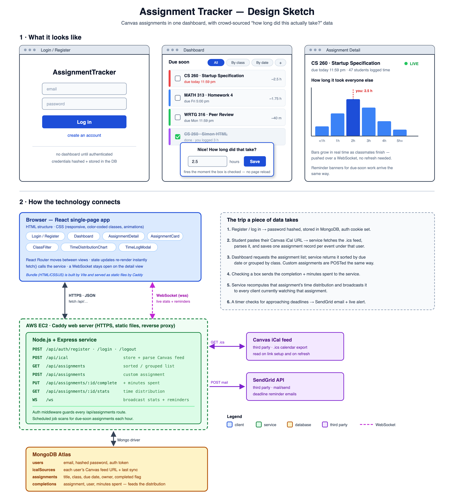

# Specification Deliverable: BYU Student Homework Tracker
## What's New (for the TA's)
 - Startup Specification Assignment. Everything is new, this is the first assignment.
 
## Elevator Pitch
Every BYU student needs a way to track everything due across their classes, and the tools already out there don't cut it. Canvas buries assignments in course-by-course lists, and Learning Suite is being phased out entirely. My idea pulls a student's assignments straight from their Canvas iCal feed into one clean dashboard, where they can check things off and get reminders as deadlines close in. What sets it apart from a glorified to-do list is time tracking: once a student marks an assignment done, the app asks how long it actually took, and that data builds into a live distribution anyone can see before they start. Instead of guessing whether a problem set takes thirty minutes or three hours, a student can see what it actually took everyone else.

## List of Key Features
1. Ability to load all assignments from Canvas
2. Ability to add custom assignments
3. Ability to sort assignments by class, due date, etc.
4. Be able to check off assignments
5. Upon completion, user is prompted to enter the time spent
6. Ability to view a summary of time spent by others on each assignment

## Plan to use each skill / technology
- [ ] **HTML** - Uses correct HTML structure for application. Pages/views for dashboard, class detail/assignment detail, and login/register. Semantic elements for assignment lists, the iCal-link setup form, and the time-logging modal.
- [ ] **CSS** - Application styling that looks good on different screen sizes. Color-coded classes, due-soon highlighting on the dashboard, and animated transitions for checking off assignments and the time-distribution chart rendering.
- [ ] **React** - Provides login, dashboard display, checking off assignments, time-logging prompts, and backend endpoint calls. Divided into pieces like AssignmentCard, ClassFilter, and TimeDistributionChart, with routing between the Dashboard and Assignment Detail views. Reactive to user actions. Checking off an assignment instantly triggers the time-logging prompt without a page reload.
- [ ] **Service** - Backend service with endpoints for:
  - storing and parsing a student's Canvas iCal link into assignment records
  - retrieving assignments, sorted by date or grouped by class
  - marking an assignment complete and logging how long it took
  - retrieving aggregated time-distribution stats for a given assignment
  - sending deadline reminder emails using the [SendGrid API](https://docs.sendgrid.com/api-reference/mail-send/mail-send)
  - Register, login, and logout users. Credentials securely stored in database. Can't view a dashboard unless authenticated.
- [ ] **DB** - Store user accounts and credentials, each user's iCal source, parsed assignments, and completion status/logged times in the database.
- [ ] **WebSocket** - As other students log how long an assignment took them, anyone currently viewing that assignment's detail page sees the time-distribution chart update live, without refreshing. Deadline reminder alerts are also pushed to the dashboard in real time as they approach.

## Design Sketch

The top row sketches the three main views: **login/register**, the **dashboard** (assignments pulled from Canvas, color-coded by class and sorted by due date, with the time-logging prompt that fires the instant a box is checked), and the **assignment detail** view with its live time-distribution chart.

The bottom half shows how the pieces connect. The React client talks to the Express service two ways: ordinary HTTPS calls for reading and writing assignments, and an open WebSocket that pushes new time data and deadline alerts down to anyone currently viewing an assignment. The service is the only thing that touches MongoDB, the student's Canvas iCal feed, and the SendGrid API.

