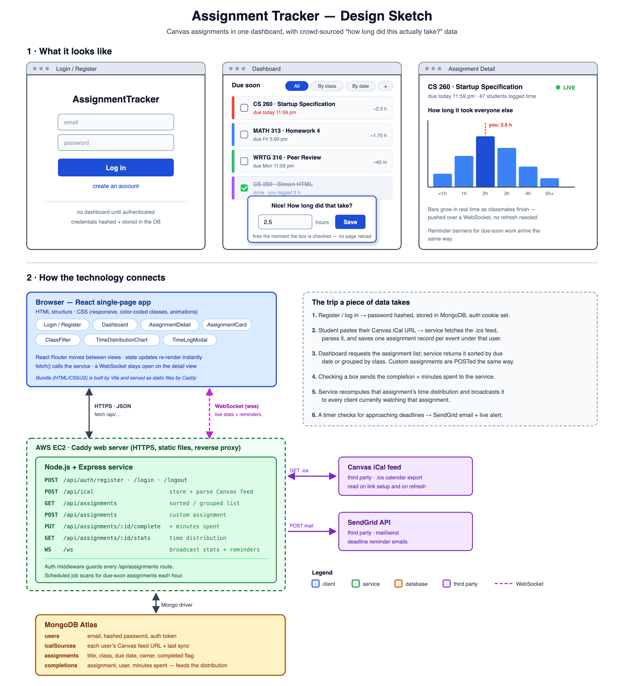

# What's New (for the TA's)
- Deployed Simon CSS
- Started the Startup CSS Deliverable: added Bootstrap, the Inter font, and a shared `main.css` with the BYU color palette
- Fixed the deploy script so it also uploads CSS and JavaScript files
- Styled the header, navbar, and footer on every page. The nav collapses into a menu on phones
- Styled the login page: two-column grid layout, Bootstrap sign-in card, and a checkmark feature list
- Styled the dashboard: live alert cards, color-coded assignment table, time-logging prompt, and a sidebar for the forms
- Styled the assignment detail page. The time distribution is now a bar chart drawn with CSS from the table data, replacing the placeholder photo
- Styled the settings page: four cards in a grid, color-coded sync table, numbered setup steps, and red buttons for the destructive actions
- Tested every page at phone, tablet, and desktop widths
- Started React part1. Set up Vite and moved my files into `public/` and `src/`
- Installed React and got the first `App` component showing with `npm run dev`
- Moved the header and footer into the `App` component
- Added the React router with a stub component for each page and a 404 page
- Moved the login page into its own component and CSS file
- Moved the dashboard into its own component and CSS file
- Moved the assignment detail page into its own component and CSS file

# React part1

## What I did for Each Rubric Item
- [x] **10% Bundled using Vite**

  I set up npm and installed Vite. The scripts are in `package.json`. `npm run dev` runs the app while I work on it, `npm run build` bundles it, and `npm run preview` lets me test the bundled version before I deploy.

  I also moved my files around so Vite can find them. Images live in `public/` now, and all the React code goes in `src/`, with a folder for each page. `main.css` became `src/app.css`. I added `node_modules`, `dist`, and `build` to `.gitignore` so none of that ends up on GitHub.

  React, React Router, Bootstrap, and React Bootstrap all come from npm now instead of a CDN link. `index.html` is just an empty `root` div, and `index.jsx` loads my `App` component from `src/app.jsx` into it. While I port each page, the old HTML files sit in `css-version/` so I can copy from them. Each one gets deleted once its component is done.

- [ ] **70% Multiple React components that contain your HTML and CSS**

  Each page is its own component in its own folder, with its own CSS file that the component imports. `src/app.css` keeps only the shared stuff like colors, the header, the footer, and cards.

  - **App** (`src/app.jsx` and `app.css`): the header and footer used to be copied into all four HTML pages. Now they live here once. The navbar is a React Bootstrap `Navbar`, so the phone menu still opens and closes without Bootstrap's JavaScript file. The footer still has my name and the GitHub link. React puts everything inside a `root` div instead of right in `body`, so the flex layout that keeps the footer at the bottom moved to an `.app` wrapper.

  - **Login** (`src/login/login.jsx` and `login.css`): the sign in card, the feature list, and the design sketch. The blue banner with my name and GitHub link moved in here too, since only the login page has it. Login and Create Account take you to the dashboard. The fields are still required, so you have to type something first.

  - **Dashboard** (`src/dashboard/dashboard.jsx` and `dashboard.css`): live alerts, the color-coded assignment table, the time logging box, and the sidebar forms. Each assignment title is a router `Link` to its own `/assignment/:id`, and "Manage your Canvas link" links to `/settings`. The checked box uses `defaultChecked` and the hours box uses `defaultValue` so React lets you change them. The forms don't reload the page anymore.

  - **Assignment** (`src/assignment/assignment.jsx` and `assignment.css`): the shared detail page for any assignment, with the summary tiles, the bar chart, the stat tiles, the Mark It Done form, and student notes. The bar chart was the interesting part. In HTML each row had `style="--count: 12"`, but JSX wants an object, so it became `style={{ '--count': 12 }}`. The CSS still reads `--count` to set each bar's height. "Back to dashboard" is a router `Link` now.

  A few styles are used on more than one page, like the class colors, the "Live" tag, and the hours input. Those stayed in `app.css` so I'm not copying them into every page's CSS.

- [x] **20% React router**

  `src/app.jsx` wraps the whole app in a `BrowserRouter`. The `Routes` block sits between the header and footer and swaps in a component for each path: `/` for Login, `/dashboard`, `/assignment/:id`, and `/settings`. Anything else shows a 404 page with a link back to the dashboard.

  The nav links are React Router `NavLink`s, so clicking one changes the page without reloading. `NavLink` also puts an `active` class on the link for the page you're on, which replaced the ID selector trick I used in the CSS version. On a phone, the menu closes after you tap a link.

  The assignment route takes an id because every assignment uses the same detail page. For now the nav link opens a sample one, `/assignment/cs260-startup-html`.

# Startup CSS Deliverable
https://startup.cs260hwtrackr.click/

**Note on the assignment detail page:** every assignment on the dashboard links to the same `assignment.html`, which always shows the Startup HTML Deliverable. That is on purpose. It is a shared template, and once React is in, one route (`/assignment/:id`) will fill it with whichever assignment you clicked.

## What I did for Each Rubric Item
- [x] **10% Visually appealing colors and layout. No overflowing elements.**

  Every page has a navy BYU navbar across the top with a slight shadow, and the login page adds a navy to royal gradient banner for the tagline. The footer is white with a thin border, so it reads as separate from the gray page background.

  On the login page, the sign-in form sits in a white card with a navy stripe across the top. The feature list uses royal blue check marks, and the design sketch has a border and shadow so it doesn't blend into the background.

  The dashboard color-codes every class. CS 260 is royal blue, FIN 401 is green, MCOM 320 is orange, and REL A 275 is purple. Each row has a colored stripe down its left edge and a tag in the same color. Anything due soon turns amber with a "Due soon" badge.

  On the assignment detail page, the summary card's top stripe and course label take the class color, so a CS 260 assignment is royal and a FIN 401 assignment would be green. The details, time stats, and student notes are each laid out as tiles so nothing is just a plain list.

  On settings, the buttons that remove or delete something (Remove Link, Delete Account) are outlined in red so they don't look like the normal navy actions. The sync table uses the same class colors as the dashboard.

  For overflow, I checked all four pages at 360, 390, 768, 1024, and 1440 pixels wide. At every size the page is exactly as wide as the window, with no sideways scroll and no element running past the edge.

- [x] **20% Use of a CSS framework such as Bootstrap**

  Every page loads Bootstrap 5.3.8 from the jsDelivr CDN, along with its JavaScript bundle for the collapsing nav. I didn't keep Bootstrap's default blue. At the top of `main.css` I point Bootstrap's own variables (`--bs-primary`, `--bs-link-color`, `--bs-body-font-family`, and the button variables) at BYU navy and royal, so any Bootstrap component I drop in already matches the rest of the site.

  The header on every page is a Bootstrap `navbar` with `navbar-expand-lg`, a `navbar-toggler` button, and a `collapse` section, so the links fold into a menu on small screens. The page content sits in a Bootstrap `container`, which lines it up with the navbar. The Logout link is a `btn btn-outline-light`.

  The login form uses a Bootstrap `card`, `form-label` and `form-control` on the inputs, `mb-3` for spacing, and `btn btn-primary` / `btn btn-outline-primary` for Login and Create Account. Bootstrap hard-codes its own blue into the glow around a focused input, so I override that in `main.css` to use BYU royal on every form in the site.

  The dashboard uses Bootstrap `card` for the three panels, `form-select` for the filters, `table table-hover align-middle` inside a `table-responsive` wrapper for the assignment list, `form-check-input` for the checkboxes, and `badge` for the due soon tag. The Add Assignment button is `btn btn-primary w-100` so it fills its card.

  The assignment detail page uses `card` for each panel, `form-check`, `form-check-input`, and `form-check-label` for the checkbox, `form-control` on the hours input and the textarea, and `btn btn-outline-primary` for Open in Canvas.

  Settings uses `card` for its four panels, `form-control` and `form-select` in both forms, `form-switch` to turn the Sunday summary checkbox into an on/off toggle, `table` in a `table-responsive` wrapper for the sync status, and `btn-outline-danger` for Remove Link and Delete Account. I pointed the danger button's variables at a darker red that sits better next to BYU navy.

- [x] **20% All visual elements styled using CSS**

  - **Header:** navy navbar, with the `h1` as the brand and "for Students" dimmed next to it. On the login page, a gradient banner holds the tagline and GitHub link.
  - **Nav links:** faded white until you hover over them or they are the current page, then full white with an underline.
  - **Signed in line:** the username is bold, and Logout is a small outlined button.
  - **Footer:** white bar with a top border and muted text.
  - **Login form:** card with a navy top stripe and shadow, full-width inputs, and matching Login and Create Account buttons.
  - **Feature list:** the default bullets are replaced with white check marks in royal circles.
  - **Design sketch:** bordered and shadowed, and it lifts slightly when you hover over it.
  - **Live alerts:** each alert is its own card with a colored left edge (amber for deadlines, royal for classmate activity). They slide in one after another when the page loads, and a green "Live" pill next to the heading has a pulsing dot.
  - **Assignment table:** uppercase column headers, a class color stripe and tag on every row, and amber text plus a badge on the one due soonest. Checking a box grays out the row and strikes through the title.
  - **Time-logging prompt:** a light blue box with a royal border under the table that pops in when the page loads. I left it inline instead of as a true pop-up, because it is always open for now and a pop-up would cover the page with no way to close it until React is in.
  - **Connected services:** green dots next to each service to show it is connected.
  - **Assignment summary:** the due date, status, source, and points are gray tiles with small uppercase labels. The title scales with the window.
  - **Time distribution chart:** the HTML deliverable used `chartPlaceholder.jpg` here, which was a stand-in photo. It is now the Hours Spent table itself, drawn as a bar chart entirely in CSS. Each row carries its count in a CSS variable (`style="--count: 12"`) and the bar height is `calc(var(--count) / var(--max) * 100%)`. The bars grow up from the axis when the page loads and brighten on hover. The table header is hidden on screen but kept for screen readers, so the data is still a real table.
  - **Stats and notes:** Average, Median, and Longest are three tiles with large navy numbers. Each student note is a card with the name in bold and a royal left edge.
  - **Settings:** the "Where to find it" steps are numbered with navy circles drawn from a CSS counter instead of the default list numbers, and the read-only note under them is a light blue callout. The sync table has class color stripes and tags. The account info is a list of label and value pairs split by thin lines, with the value in bold on the right.
  - **Motion:** all of the animations turn off for anyone whose system is set to reduce motion (`prefers-reduced-motion`).

- [x] **30% Responsive to window resizing using flexbox and/or grid display**

  - **Sticky footer:** `body` is a column flexbox and `main` has `flex: 1`, so the footer stays at the bottom of the window even on short pages.
  - **Navbar:** at 992px and up the links sit in one row with the sign-in info pushed to the right. Below that they collapse behind a menu button and stack. I started with 768px, but at tablet width the links and the sign-in line wrapped onto several lines, so I moved the breakpoint up.
  - **Media queries:** two of them in `main.css` change how the current page is marked. Wide screens get an underline, and the collapsed menu gets a white bar on the left.
  - **Footer:** a flex row with `flex-wrap`, so my name and the GitHub link sit on opposite sides and wrap onto two lines on a narrow screen.
  - **Tagline:** sized with `clamp()`, so it scales with the window.
  - **Login layout:** `.login-layout` is a CSS grid. On phones it is one column. At 768px and up it becomes two columns (`5fr 7fr`), with the sign-in card on the left and the features and sketch on the right. The card is `position: sticky`, so it stays in view while you scroll past the sketch.
  - **Login buttons:** a flex row where each button has `flex: 1 1 8rem`, so they split the width evenly and stack if the card gets too narrow.
  - **Dashboard layout:** `.dashboard-grid` is a CSS grid. Below 992px everything stacks. Above it, the assignments card takes the main column and the two forms move into a `20rem` sidebar, which is a flex column.
  - **Live alerts:** a grid with `repeat(auto-fit, minmax(13rem, 1fr))`, so the alerts show three across on a tablet or laptop and drop to one per line on a phone without any media query.
  - **Filter bar:** a wrapping flex row. The two dropdowns share the space and the Apply button keeps its size.
  - **Assignment table on phones:** five columns don't fit on a phone. Below 576px each row turns into its own small CSS grid with named areas, with the checkbox on the left, the class tag and average on top, then the title, then the due date. The column headers hide, and the average gets an "Avg" label so it still makes sense.
  - **Assignment detail layout:** `.detail-grid` is a CSS grid. On large screens the summary and notes span both columns (`grid-column: 1 / -1`) and the chart and the Mark It Done form share the middle row at `3fr 2fr`. Below 992px it is one column.
  - **Detail tiles and notes:** both use `repeat(auto-fit, minmax(...))`, so they go four across (details) or three across (notes) on a laptop and fold down on a phone.
  - **Bar chart:** the table body is a flex row of bars, and each row is a two-row grid with the bar on top and its label under it. The gap between bars shrinks with the window through `clamp()`.
  - **Stat tiles:** a wrapping flex row that keeps all three on one line even at phone width.
  - **Settings layout:** `.settings-grid` is two equal columns at 992px and up, one column below. The cards fill the grid in source order, so the Canvas link sits next to its sync status and the reminder settings sit next to the account card.
  - **No overflow:** the HTML had `size="60"` on the iCal URL input, which forced the page wider than a phone. I removed it, and the input now fills its card and cuts the URL off with an ellipsis. The sync table sits in `table-responsive` so it can never push past the card either.
  - **Settings rows:** the button rows, the sync footer, and each account line are wrapping flex rows, so a label and its value move onto two lines instead of overflowing when the card gets narrow.

- [x] **10% Use of a imported font**

  The whole site uses Inter from Google Fonts. It is imported at the top of `main.css` with `@import url("https://fonts.googleapis.com/css2?family=Inter...")`, then set once on `body` through a `--font-body` variable, with system fonts as a fallback if Google Fonts doesn't load.

- [x] **10% Use of different types of selectors including element, class, ID, and pseudo selectors**

  - **Element:** `body`, `h1` through `h3`, `a`, `img`, and `main` set the base look.
  - **Class:** `.btn-primary` and `.btn-outline-primary` recolor Bootstrap's buttons. `.user-info`, `.username`, `.header-banner`, and `.site-footer` style the header and footer.
  - **ID:** each `body` has an id (`#page-dashboard`) and so does each nav link (`#nav-dashboard`). `#page-dashboard #nav-dashboard` only matches on the dashboard, which is how the current page gets highlighted without any JavaScript. `#ical` styles the Canvas URL input on its own.
  - **Descendant:** `header .nav-link`, `.header-banner a`, and `.sketch img` only reach elements inside those sections.
  - **Element plus class:** `dialog.time-log` styles only the time-logging dialog.
  - **Adjacent sibling:** `.service-list li + li` adds space above every service except the first.
  - **Child:** `.card-body > h2` only sizes headings that sit directly inside a card.
  - **Pseudo-classes:**
    - `:root` holds the color variables.
    - `a:hover`, `a:focus-visible`, and `.form-control:focus` handle link and input states.
    - `tr:has(.form-check-input:checked)` finds any dashboard row whose checkbox is checked and strikes it through, with no JavaScript.
    - `:nth-child()` staggers the alert and bar chart animations, and on phones places each table cell in its row's grid.
    - `td:first-child` and `td:last-child` tell a bar chart label from its bar, and `.account-list li:last-child` drops the divider under the last account row.
  - **Pseudo-elements:**
    - The nav underline is `::after`, and it grows in on `:hover`.
    - The feature list check marks, the back link arrow, and the numbered settings steps are all `::before`. The steps get their numbers from a CSS counter.
    - `::selection` colors highlighted text.

# Startup HTML Deliverable

Live site: [startup.cs260hwtrackr.click](https://startup.cs260hwtrackr.click)

## What I Did For Each Rubric Item

**20% HTML pages for each component of your application**

Four pages, one for each part of the app.

- `index.html` is the login and register page. It loads by default.
- `dashboard.html` is the main view with the assignment list.
- `assignment.html` is the detail view for a single assignment.
- `settings.html` is where the Canvas calendar link and the email reminders get set up.

**10% Proper use of HTML tags including BODY, NAV, MAIN, HEADER, FOOTER**

All four pages share the same skeleton. The `header` holds the app name, the signed in user, and the `nav`. The `main` holds the content, split into `section` elements by topic. The `footer` has my name and a link to this repo. Inside that I used `table` with `thead` and `tbody` for the assignment lists, `dl` for the assignment details, `form` and `label` on every input, and `figure` with `figcaption` for the images.

**10% Links between pages as necessary**

The nav bar is on every page and links to every page. Past that, each assignment title on the dashboard opens the detail view, the detail view links back to the dashboard, the dashboard points to settings, and the login form sends you through to the dashboard. You can click through the entire app without a line of JavaScript.

**10% Application textual content**

None of it is filler. The login page explains what the app does and why I built it. The settings page walks through finding your Canvas calendar feed, since that is the step people actually get stuck on. The assignment page has a description, the stats, and notes other students left behind. The sample data uses the classes I am taking right now.

**10% Placeholder for 3rd party service calls**

Both of my services live on `settings.html`, with a summary on the dashboard under Connected Services. The Canvas iCal field is where a student pastes their calendar link, and the service will fetch that URL, parse it, and save every assignment it finds. The reminder settings below it control the deadline emails I will send through SendGrid.

**10% Application images**

`designSketch.png` sits on the login page and shows the three main views. `chartPlaceholder.jpg` on the assignment page stands in for the time distribution chart until React can render a real one. Both have alt text.

**10% Login placeholder, including user name display**

`index.html` has the net ID and password fields with Login and Create Account buttons. After that, every page shows "Signed in as ryan.shurtliff" in the header with a logout link next to it. The name is hardcoded for now. It will come from the authenticated user once the service is running.

**10% Database data placeholder showing content stored in the database**

Anything that would come out of MongoDB is already on the page. The dashboard has the assignment table, including the checkbox state and the class average. Settings has the sync table showing each class and how many assignments came back from Canvas. The detail page has the assignment record itself, the time distribution buckets, and the notes from other students.

**10% WebSocket data placeholder showing where realtime communication will go**

Live Alerts at the top of the dashboard is where deadline warnings and other students' activity get pushed the moment they happen. The time distribution chart on the assignment page is the other half of that. When somebody finishes the assignment and logs their hours, the chart redraws for everyone who has the page open, with no refresh. HTML comments mark both spots in the source.

# Startup AWS Deliverable
## Summary of What I did for the TA's
I followed the instructions in MasteryLS and got my AWS server up and running. I added this section in response to the feedback I got from Denise on my initial submission. I had forgotten to configure the CaddyFile so that the links on the page correctly went to my page, so I went back and fixed that. The links for Simon and Startup are now both up and running.

# Specification Deliverable

## Elevator Pitch: BYU Student Homework Tracker
Every BYU student needs a way to track everything due across their classes, and the tools already out there don't cut it. Canvas buries assignments in course-by-course lists, and Learning Suite is being phased out entirely. My idea pulls a student's assignments straight from their Canvas iCal feed into one clean dashboard, where they can check things off and get reminders as deadlines close in. What sets it apart from a glorified to-do list is time tracking: once a student marks an assignment done, the app asks how long it actually took, and that data builds into a live distribution anyone can see before they start. Instead of guessing whether a problem set takes thirty minutes or three hours, a student can see what it actually took everyone else.

## List of Key Features
1. Ability to load all assignments from Canvas
2. Ability to add custom assignments
3. Ability to sort assignments by class, due date, etc.
4. Be able to check off assignments
5. Upon completion, user is prompted to enter the time spent
6. Ability to view a summary of time spent by others on each assignment

## Plan to use each skill / technology
- [x] **HTML** - Uses correct HTML structure for application. Pages/views for dashboard, class detail/assignment detail, and login/register. Semantic elements for assignment lists, the iCal-link setup form, and the time-logging modal.
- [x] **CSS** - Application styling that looks good on different screen sizes. Color-coded classes, due-soon highlighting on the dashboard, and animated transitions for checking off assignments and the time-distribution chart rendering.
- [x] **React** - Provides login, dashboard display, checking off assignments, time-logging prompts, and backend endpoint calls. Divided into pieces like AssignmentCard, ClassFilter, and TimeDistributionChart, with routing between the Dashboard and Assignment Detail views. Reactive to user actions. Checking off an assignment instantly triggers the time-logging prompt without a page reload.
- [x] **Service** - Backend service with endpoints for:
  - storing and parsing a student's Canvas iCal link into assignment records
  - retrieving assignments, sorted by date or grouped by class
  - marking an assignment complete and logging how long it took
  - retrieving aggregated time-distribution stats for a given assignment
  - sending deadline reminder emails using the [SendGrid API](https://docs.sendgrid.com/api-reference/mail-send/mail-send)
  - Register, login, and logout users. Credentials securely stored in database. Can't view a dashboard unless authenticated.
- [x] **DB** - Store user accounts and credentials, each user's iCal source, parsed assignments, and completion status/logged times in the database.
- [x] **WebSocket** - As other students log how long an assignment took them, anyone currently viewing that assignment's detail page sees the time-distribution chart update live, without refreshing. Deadline reminder alerts are also pushed to the dashboard in real time as they approach.

## Design Sketch

The top row sketches the three main views: **login/register**, the **dashboard** (assignments pulled from Canvas, color-coded by class and sorted by due date, with the time-logging prompt that fires the instant a box is checked), and the **assignment detail** view with its live time-distribution chart.

The bottom half shows how the pieces connect. The React client talks to the Express service two ways: ordinary HTTPS calls for reading and writing assignments, and an open WebSocket that pushes new time data and deadline alerts down to anyone currently viewing an assignment. The service is the only thing that touches MongoDB, the student's Canvas iCal feed, and the SendGrid API.

